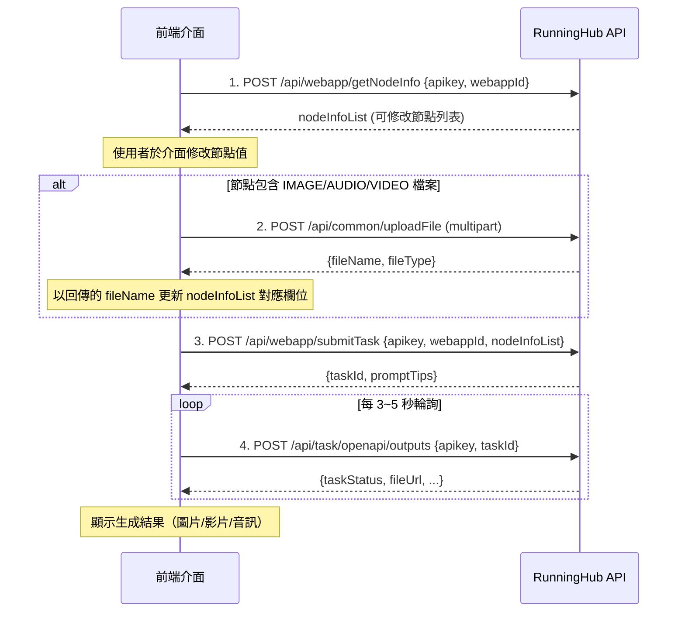

# RunningHub API 前端介面 — 操作守則及開發計畫

> 參考文件：[AI應用完整接入示例](https://www.runninghub.cn/runninghub-api-doc-cn/doc-8287339)  
> 建立日期：2026-03-12

---

## 一、API 概覽

### 1.1 基本資訊

| 項目 | 說明 |
|------|------|
| Base URL | `https://www.runninghub.cn` |
| 認證方式 | 在請求 Body 中傳入 `apikey` 欄位 |
| 資料格式 | JSON (`Content-Type: application/json`) |
| 工作流ID來源 | **AI 應用**使用 `webappId`（從 AI 詳情頁 URL 取得）；**工作流**使用 `workflowId`（從工作流頁面 URL 取得） |

### 1.2 核心 API 端點

| 步驟 | 端點 | 方法 | 說明 |
|------|------|------|------|
| 獲取節點資訊 | `/api/webapp/getNodeInfo` | POST | 根據 `webappId` 取得可修改的 `nodeInfoList` |
| 上傳檔案 | `/api/common/uploadFile` | POST | 上傳圖片/音訊/影片，取得 `fileName` |
| 提交任務 | `/api/webapp/submitTask` | POST | 提交工作流任務，回傳 `taskId` |
| 查詢任務狀態 | `/api/task/openapi/outputs` | POST | 以 `taskId` 輪詢任務執行狀態與結果 |
| 獲取帳戶資訊 | `/api/user/getAccountStatus` | POST | 查看帳戶餘額與類型 |

### 1.3 工作流模式端點（進階）

| 步驟 | 端點 | 方法 | 說明 |
|------|------|------|------|
| 獲取工作流 JSON | `/api/workflow/getWorkflowJson` | POST | 根據 `workflowId` 取得完整工作流結構 |
| 提交任務（工作流） | `/api/comfyui/openapi/v2` | POST | 提交 ComfyUI 原生格式任務 |

---

## 二、API 呼叫流程



---

## 三、核心資料結構

### 3.1 nodeInfoList 結構

```json
[
  {
    "nodeId": "39",
    "nodeName": "LoadImage",
    "fieldName": "image",
    "fieldValue": "a293d89506...37ec.jpg",
    "fieldType": "IMAGE",
    "description": "上傳圖像"
  },
  {
    "nodeId": "52",
    "nodeName": "RH_Translator",
    "fieldName": "prompt",
    "fieldValue": "給這個女人的髮型變成齊耳短髮",
    "fieldType": "STRING",
    "description": "圖像編輯文本輸入框"
  },
  {
    "nodeId": "37",
    "nodeName": "RH_ComfyFluxKontext",
    "fieldName": "aspect_ratio",
    "fieldValue": "match_input_image",
    "fieldType": "LIST",
    "description": "輸出比例"
  }
]
```

### 3.2 fieldType 類型對照

| fieldType | 前端元件建議 | 說明 |
|-----------|-------------|------|
| `STRING` | `<textarea>` 或 `<input type="text">` | 文字輸入 |
| `INT` | `<input type="number">` | 整數（如 seed） |
| `FLOAT` | `<input type="number" step="0.01">` | 浮點數（如 cfg） |
| `IMAGE` | `<input type="file">` + 上傳按鈕 | 圖片上傳，需先調用 uploadFile |
| `VIDEO` | `<input type="file">` + 上傳按鈕 | 影片上傳，需先調用 uploadFile |
| `AUDIO` | `<input type="file">` + 上傳按鈕 | 音訊上傳，需先調用 uploadFile |
| `LIST` | `<select>` 下拉選單 | 從 `fieldData` 中選取值 |
| `BOOLEAN` | `<input type="checkbox">` | 布爾值切換 |

### 3.3 任務狀態值

| taskStatus | 說明 | 前端顯示建議 |
|------------|------|-------------|
| `QUEUED` | 排隊中 | ⏳ 排隊等待中... |
| `RUNNING` | 執行中 | 🔄 任務執行中... |
| `SUCCESS` | 完成 | ✅ 生成完成！ |
| `FAILED` | 失敗 | ❌ 任務失敗 |
| `TIMEOUT` | 逾時 | ⏱️ 任務逾時 |

---

## 四、API KEY 管理方案

### 4.1 載入優先順序

```
環境變數 (RUNNINGHUB_API_KEY)  →  config.json  →  使用者手動輸入
```

### 4.2 config.json 格式

```json
{
  "apiKey": "your_api_key_here",
  "baseUrl": "https://www.runninghub.cn",
  "pollingInterval": 3000,
  "maxPollingRetries": 200
}
```

### 4.3 安全須知

> [!CAUTION]
> - API Key **禁止**寫死在前端 JS 原始碼中
> - 生產環境**必須**透過後端代理轉發 API 請求
> - `config.json` 應加入 `.gitignore`，僅保留 `config.example.json`
> - 本地開發可使用環境變數 `RUNNINGHUB_API_KEY`

---

## 五、錯誤碼對照表

| 錯誤標識 | 說明 | 建議處理 |
|---------|------|---------|
| `PARAMS_INVALID` | 參數無效 | 檢查請求參數格式 |
| `WORKFLOW_NOT_EXISTS` | 工作流不存在 | 確認 workflowId 正確 |
| `WEBAPP_NOT_EXISTS` | AI 應用不存在 | 確認 webappId 正確 |
| `TOKEN_INVALID` | API Key 無效 | 檢查 API Key |
| `APIKEY_UNAUTHORIZED` | API Key 未授權 | 確認 Key 有效且已充值 |
| `TASK_INSTANCE_MAXED` | 併發任務數上限 | 等待後重試 |
| `TASK_QUEUE_MAXED` | 隊列已滿 | 等待後重試 |
| `TASK_NOT_FOUNED` | 任務不存在 | 確認 taskId 正確 |
| `TASK_CREATE_FAILED_BY_NOT_ENOUGH_WALLET` | 餘額不足 | 通知使用者充值 |
| `VALIDATE_PROMPT_FAILED` | 工作流驗證失敗 | 檢查節點參數 |
| `APIKEY_UPLOAD_FAILED` | 上傳失敗 | 重試或檢查檔案 |
| `APIKEY_FILE_SIZE_EXCEEDED` | 檔案過大 | 壓縮後重試 |
| `APIKEY_TASK_IS_RUNNING` | 任務正在執行 | 等待完成 |
| `APIKEY_TASK_IS_QUEUED` | 任務正在排隊 | 等待 |
| `APIKEY_UNSUPPORTED_FREE_USER` | 免費用戶不支援 API | 提示升級帳戶 |

---

## 六、前端介面開發計畫

### 6.1 技術棧

| 類別 | 選用 |
|------|------|
| 框架 | 純 HTML + CSS + JavaScript（或 Vite + Vanilla） |
| 樣式 | Vanilla CSS，深色主題 |
| HTTP 請求 | Fetch API |
| 狀態管理 | 原生 JS 模組 |
| 設定管理 | config.json + 環境變數 |

### 6.2 頁面結構

```
┌─────────────────────────────────────────────────┐
│  Header: RunningHub API Client                  │
├──────────────────┬──────────────────────────────┤
│                  │                              │
│  設定面板         │     主工作區                  │
│  ┌────────────┐  │  ┌──────────────────────┐    │
│  │ API Key    │  │  │ 節點列表 & 編輯區     │    │
│  │ (自動載入)  │  │  │ (根據 nodeInfoList   │    │
│  ├────────────┤  │  │  動態生成表單)        │    │
│  │ Workflow ID│  │  ├──────────────────────┤    │
│  │ (手動輸入)  │  │  │ 操作按鈕              │    │
│  ├────────────┤  │  │ [獲取節點] [提交任務]  │    │
│  │ [載入節點]  │  │  ├──────────────────────┤    │
│  └────────────┘  │  │ 狀態 & 結果顯示區     │    │
│                  │  │ (進度條/圖片/影片)     │    │
│  任務歷史列表     │  └──────────────────────┘    │
│                  │                              │
└──────────────────┴──────────────────────────────┘
```

### 6.3 功能模組拆分

#### 模組 A：設定管理（Config Manager）
- 啟動時依優先順序載入 API Key：`環境變數 → config.json → 手動輸入`
- Workflow ID 由使用者在介面手動填寫
- 可儲存最近使用的 Workflow ID 到 `localStorage`

#### 模組 B：節點獲取與解析（Node Fetcher）
- 呼叫 `getNodeInfo` 取得 `nodeInfoList`
- 依據 `fieldType` 動態渲染對應表單元件
- LIST 類型讀取 `fieldData` 渲染下拉選單

#### 模組 C：檔案上傳（File Uploader）
- 支援 IMAGE / VIDEO / AUDIO 三種類型
- 使用 `FormData` 搭配 `multipart/form-data`
- 上傳完成後自動更新 `nodeInfoList` 中的 `fieldValue`
- 顯示上傳進度與預覽

#### 模組 D：任務提交與狀態追蹤（Task Manager）
- 組裝修改後的 `nodeInfoList` 提交任務
- 取得 `taskId` 後啟動輪詢（預設 3 秒間隔）
- 解析 `promptTips` 中的 `node_errors` 顯示錯誤
- 自動停止條件：`SUCCESS` / `FAILED` / 超過最大重試次數

#### 模組 E：結果展示（Result Viewer）
- 根據 `fileType` 顯示圖片 / 影片 / 音訊
- 支援下載生成結果
- 顯示 `taskCostTime` 等元資料

#### 模組 F：任務歷史（Task History）
- 記錄到 `localStorage`
- 支援查看歷史結果

### 6.4 檔案結構規劃

```
RHAPI/
├── index.html              # 主頁面
├── css/
│   └── style.css           # 全域樣式（深色主題）
├── js/
│   ├── app.js              # 應用入口 & 初始化
│   ├── config.js           # 設定管理模組
│   ├── api.js              # API 呼叫封裝
│   ├── nodeRenderer.js     # 節點解析 & 表單渲染
│   ├── taskManager.js      # 任務提交 & 狀態輪詢
│   └── resultViewer.js     # 結果展示
├── config.example.json     # 設定檔範例（不含真實 Key）
├── config.json             # 實際設定檔（.gitignore 排除）
├── .gitignore
└── README.md
```

---

## 七、操作守則

### 7.1 API 請求守則

1. **所有 API 請求**都必須在 Body 中帶入 `apikey` 欄位
2. **文件上傳**使用 `multipart/form-data`，其他請求使用 `application/json`
3. **輪詢間隔**不低於 3 秒，避免被限流
4. **最大輪詢次數**建議 200 次（約 10 分鐘），超過後提示使用者
5. **錯誤重試**：網路錯誤最多重試 3 次，間隔指數遞增

### 7.2 nodeInfoList 操作守則

1. **只修改需要改變的欄位**，未修改的保持原始值
2. **fieldValue 為 `[]` 包裹的值**代表連線關係，**禁止修改**
3. **seed 值**會被 API 強制重置，若需固定 seed，必須在 `nodeInfoList` 中明確傳入
4. **IMAGE 類型**必須先上傳檔案，再用回傳的 `fileName` 替換 `fieldValue`
5. **LIST 類型**的值必須從 `fieldData` 提供的選項中選取

### 7.3 安全守則

1. **開發環境**：API Key 存放在 `config.json`（已 gitignore）或環境變數
2. **生產環境**：API Key 存放在後端，前端透過自建代理伺服器轉發請求
3. **永不提交** `config.json` 到版本控制系統
4. **定期輪替** API Key

### 7.4 CORS 處理

> [!IMPORTANT]
> RunningHub API 可能不允許瀏覽器直接跨域呼叫。有以下處理方案：
> 1. **開發階段**：使用 Vite/Webpack dev server 的 proxy 配置
> 2. **生產階段**：自建 Node.js / Nginx 反向代理

代理配置示例（Vite `vite.config.js`）：

```js
export default {
  server: {
    proxy: {
      '/api': {
        target: 'https://www.runninghub.cn',
        changeOrigin: true
      }
    }
  }
}
```

---

## 八、開發里程碑

| 階段 | 內容 | 預估時間 |
|------|------|---------|
| **Phase 1** | 專案初始化 + config 機制 + API 封裝 | 0.5 天 |
| **Phase 2** | 節點獲取 + 動態表單渲染 | 1 天 |
| **Phase 3** | 檔案上傳 + 任務提交 + 狀態輪詢 | 1 天 |
| **Phase 4** | 結果展示（圖片/影片/音訊） | 0.5 天 |
| **Phase 5** | UI 美化 + 深色主題 + 動畫 | 0.5 天 |
| **Phase 6** | 任務歷史 + 錯誤處理優化 | 0.5 天 |
| **Phase 7** | 測試 + 文件 + 部署 | 0.5 天 |

---

## 九、驗證計畫

### 自動化驗證
- 使用瀏覽器工具驗證前端介面能正確載入 config.json
- 驗證表單根據 nodeInfoList 正確動態渲染
- 驗證 API 回應格式正確解析

### 手動驗證
1. 填入正確的 API Key 和 webappId，點擊「獲取節點」，確認節點列表正確顯示
2. 修改 STRING 類型欄位後提交任務，確認任務成功提交並取回結果
3. 上傳圖片到 IMAGE 類型欄位，確認上傳成功且 fieldValue 正確更新
4. 提交任務後觀察狀態輪詢，確認能正確顯示 QUEUED → RUNNING → SUCCESS
5. 測試錯誤場景：無效 API Key、空白 webappId、無效節點值

---

> 📋 本文件為 RunningHub API 前端專案的操作守則與開發計畫，作為後續開發的參考基準。
